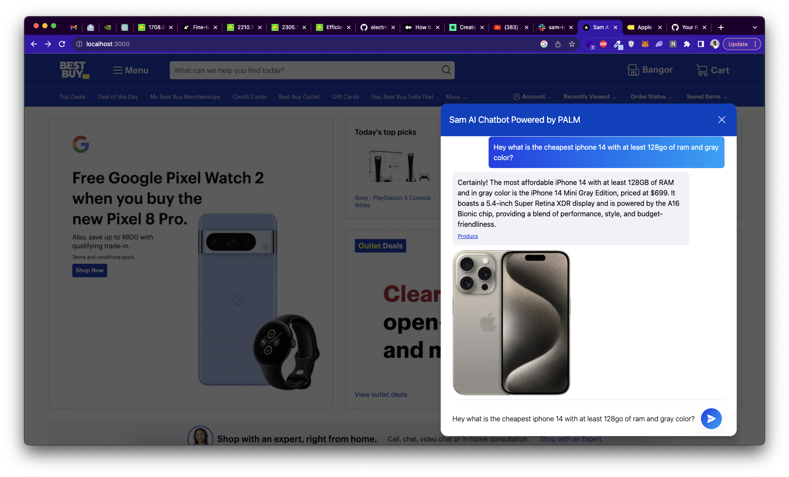

## Getting Started

First, run the development server:

```bash
git clone https://github.com/bm777/sam-ai.git
cd sam-ai
npm run dev
```

Open [http://localhost:3000](http://localhost:3000) with your browser to see the result.


<p align="center"></p>